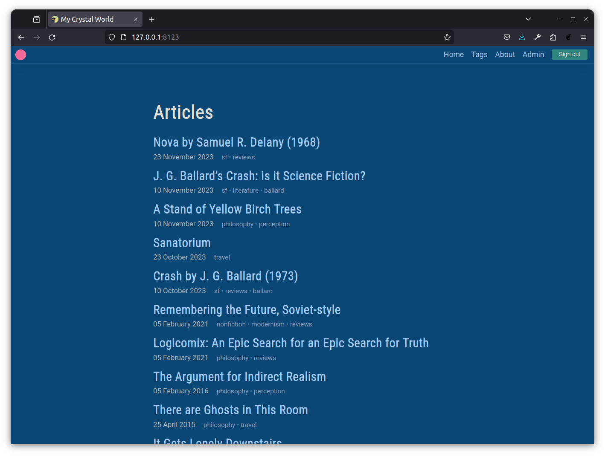
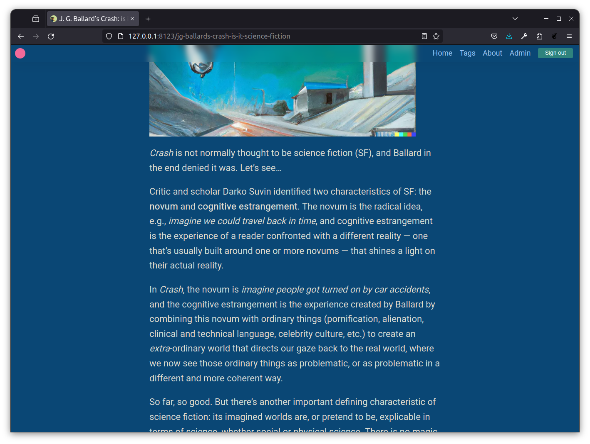
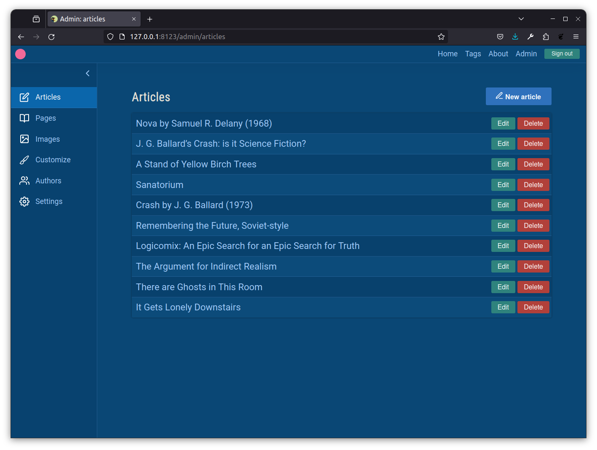
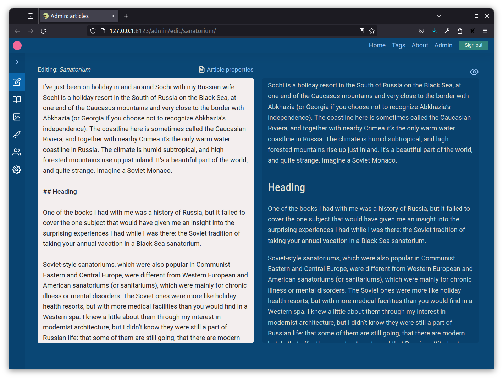
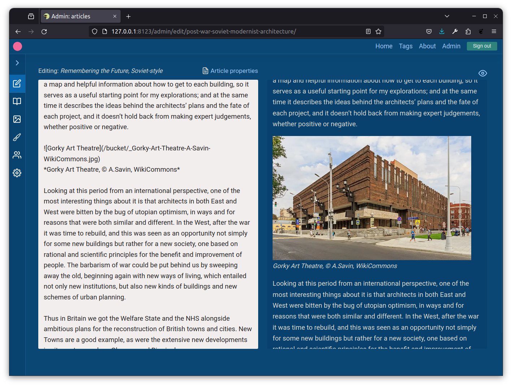
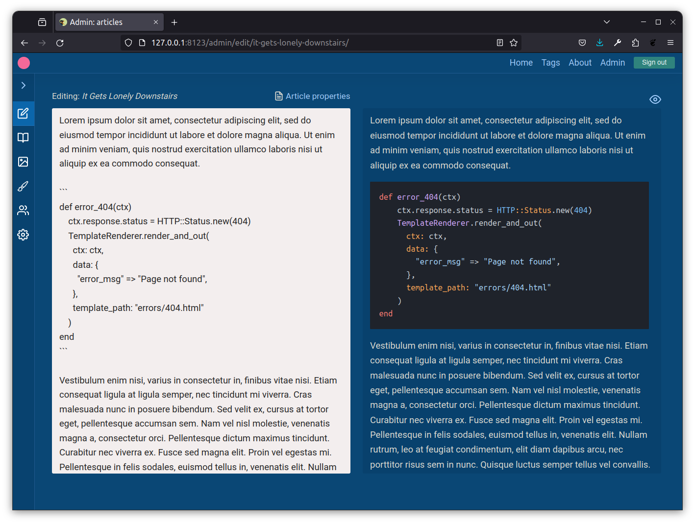
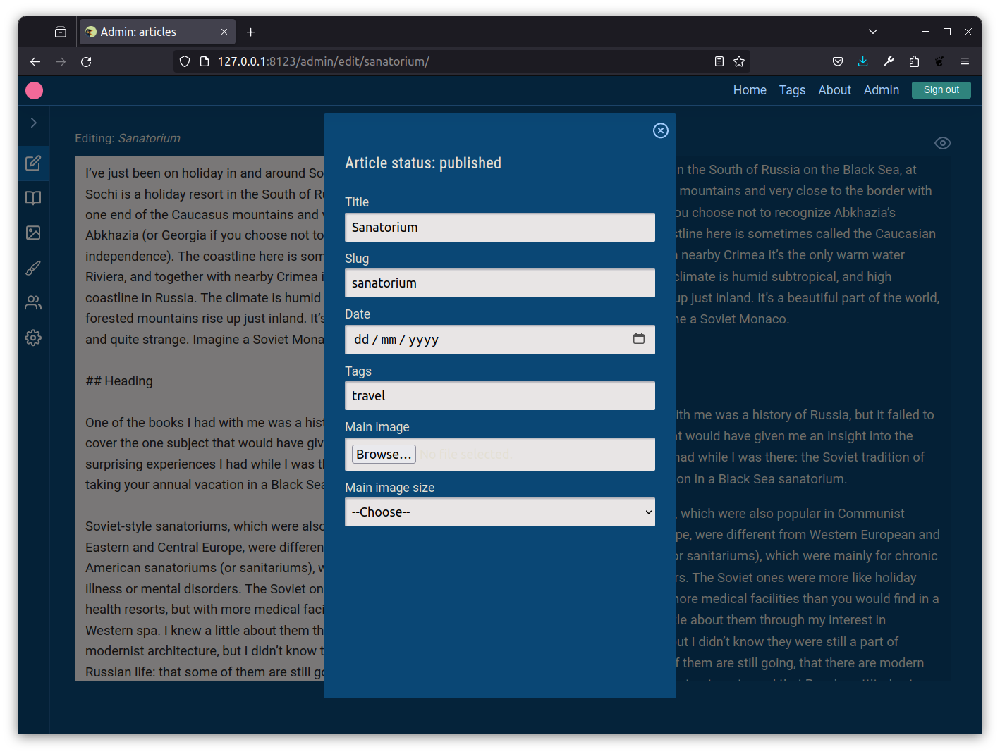

# The Crystal World

A reinventing-the-wheel project, mainly for learning: a blog application written in the [Crystal](https://crystal-lang.org/) compiled programming language, without a framework, inspired by the [Frameworkless Manifesto](https://github.com/frameworkless-movement/manifesto).

The main objectives here are:

- Implementing the basics without a framework:
  - Routing
  - Authentication and sessions
  - Cookie management
  - Template rendering
  - Database access
  - CSRF and XSS prevention
- Testing different patterns and architectures
- Learning a new programming language that's as nice to read as Python or Ruby, but _fast_
- Building a groundwork for small real-world projects that's easy and enjoyable to use
- On the client-side, replacing all (self-written) JavaScript with HTMX and Hyperscript while retaining a fast, SPA-like user experience

### Features

- Admin section/CMS
- Edit articles in Markdown, with instant previews
- CRUD for articles, authors, pages, customization, and settings
- Cloud API-based image management for CMS
- Choose from two separate modes of operation:
  - File-based (Markdown files with frontmatter)
  - Or data-based (SQLite3 database)

### Screenshots

