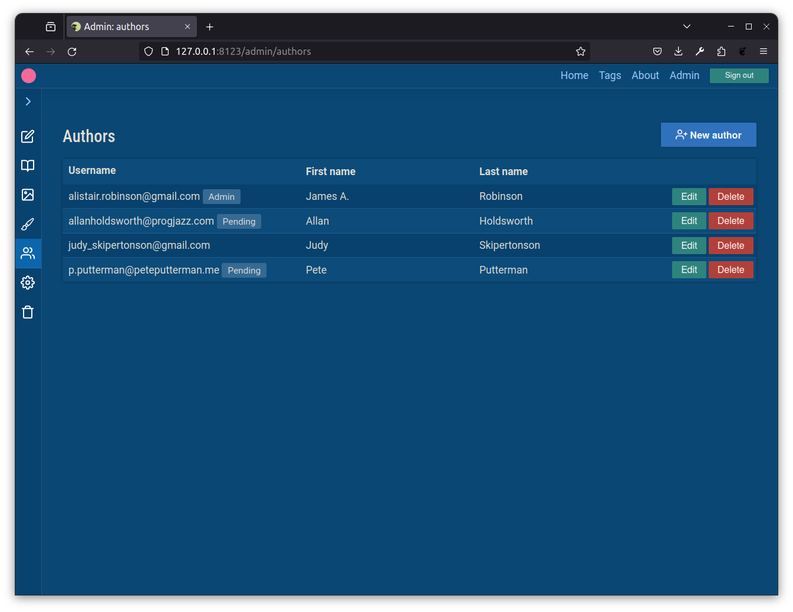

# The Crystal World

A reinventing-the-wheel project, mainly for learning and consolidating my knowledge. It's a blog application written in the [Crystal](https://crystal-lang.org/) compiled programming language, with neither a front-end nor a back-end framework (inspired by the [Frameworkless Manifesto](https://github.com/frameworkless-movement/manifesto)).

And although it's _prima facie_ an old-fashioned server-centric dynamic website and thin-client CRUD application, in terms of UX it feels more like a Next.js or Astro SSG website, thanks to the judicious use of HTMX and Hyperscript.

The main objectives here are:

- Implementing the basics without a framework:
  - Routing
  - Authentication and sessions
  - Cookie management
  - Template rendering
  - Database access
  - CSRF and XSS prevention
  - Reactive UI, with no full page loads
  - Image uploading and hosting
- Testing different patterns and architectures
- Learning a new programming language that's as nice to read as Python or Ruby, but _fast_
- Building a usable groundwork for small real-world projects which is enjoyable to use
- On the client-side, using HTMX, Hyperscript, and vanilla JS to make a fast, SPA-like user experience

### Features

- Admin section/CMS
- Edit articles in Markdown, with instant previews
- CRUD for articles, authors, pages, customization, and settings
- Cloud API-based image management for CMS

### Screenshots

